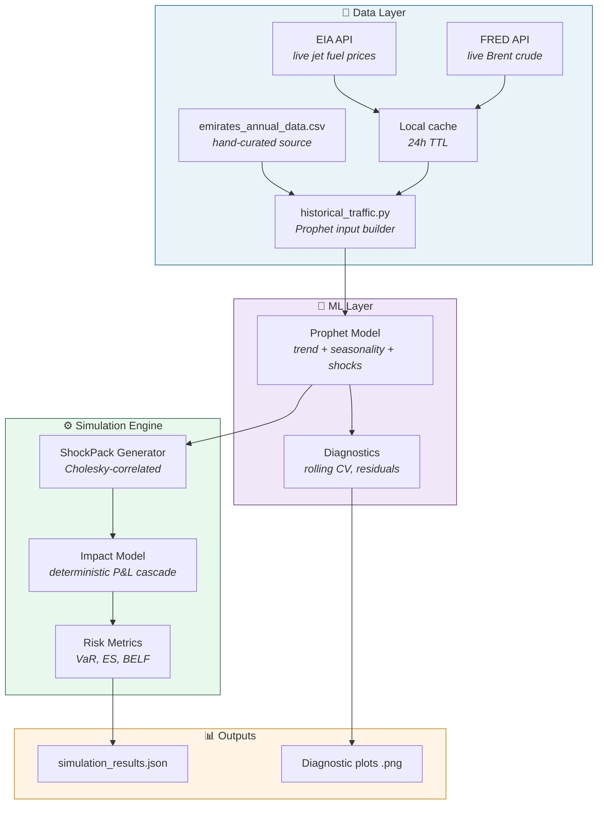
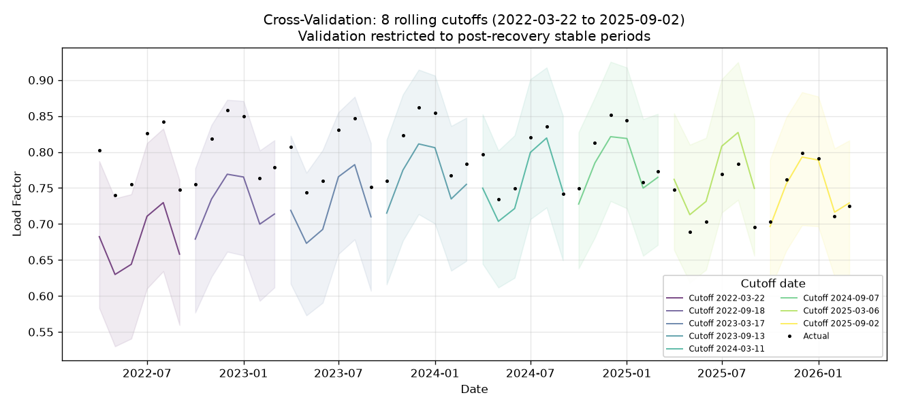
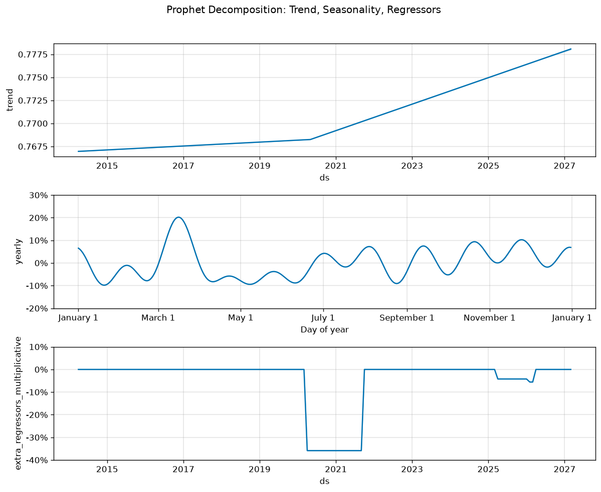
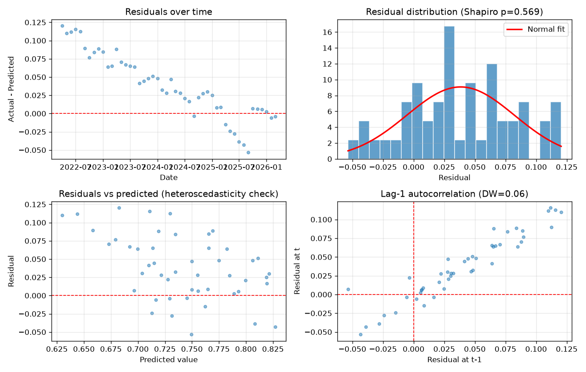

# Aviation Route Monte Carlo Engine

**Monte Carlo simulation of airline route profitability under uncertainty, calibrated to the Emirates ISC corridor.**

A senior-level data science portfolio piece combining:
- Probabilistic risk simulation (Cholesky-correlated Monte Carlo across 5 variables)
- Live data ingestion from EIA and FRED APIs (jet fuel + Brent crude)
- Time-series demand forecasting (Facebook Prophet with shock-period regressors)
- Scenario analysis derived from real ISC corridor strategic intelligence conducted & validated

Route: **Dubai (DXB) → Mumbai (BOM)**, Boeing 777-300ER, 2x daily.

---

## Why this project

Airline route profitability is driven by uncertain, correlated variables which include but not limited to load factor, yield, fuel price, competitive pressure, and demand shocks. Deterministic financial models can't capture the joint distribution of these risks. Hence, a Monte Carlo approach with proper correlation structure and scenario stress-testing produces distributions of route P&L that support real revenue management decisions.

This engine answers questions like:
- What's the probability of a loss-making quarter under base assumptions?
- How does Value-at-Risk (VAR) change if competitive pressure intensifies?
- What load factor breakeven is the route operating at?
- How sensitive is route profitability to Brent crude price changes?

---

## Architecture



---

## The model layers

### Demand forecasting — Facebook Prophet

A Prophet model fits monthly load factor for the Emirates ISC corridor using 12 years of historical data (Apr 2014 – Mar 2026).

**Model specification:**

y(t) = g(t) × (1 + s(t)) × (1 + h(t))

- **g(t)** — piecewise linear trend with automatic changepoint detection
- **s(t)** — yearly seasonality (10 Fourier terms, multiplicative)
- **h(t)** — three shock-period regressors

**Why only three regressors?** The initial dnitial design included eight (Diwali, Eid, Ramadan, Hajj, summer holidays, COVID, fuel disruption, regional conflict). HOwever, I removed Calendar-recurring regressors after observing collinearity with yearly seasonality Prophet's Fourier decomposition already captures recurring patterns. Only genuinely non-recurring shock regressors are retained:

| Regressor | Period | Learned effect |
|---|---|---|
| `is_covid` | Apr 2020 – Sep 2021 | −36% |
| `is_fuel_supply_disruption` | Apr 2025 – Mar 2026 | −4% |
| `is_regional_conflict` | Feb – Mar 2026 | −1.3% |

### Monte Carlo simulation engine

**ShockPack design pattern:** all stochasticity lives in `engine/shock_generator.py`. The impact model is purely deterministic given a ShockPack. This separation enables:
- Full reproducibility (fixed seed across runs)
- Independent testing of randomness vs financial logic
- Ad-hoc scenario stress testing without re-running data ingestion

**5 stochastic variables** correlated via Cholesky decomposition:
- Load factor (Beta distribution, bounded [0,1])
- Yield per RPK (Log-normal)
- Jet fuel price (Ornstein-Uhlenbeck mean-reverting)
- Competitive index (Normal)
- Demand index (Beta)

**3 discrete event shocks:**
- Geopolitical (monthly Bernoulli)
- Regulatory (annual Bernoulli)
- AOG / aircraft on ground (monthly Bernoulli)

**6 scenarios** derived from PEST analysis and risk matrix (probability × impact):

| Scenario | Probability | Driver |
|---|---|---|
| Base case | 47% | Central assumptions |
| Competitive squeeze | 35% | IndiGo / Air India ISC expansion |
| Macro stress | 20% | UAE/India slowdown, fuel spike |
| Geopolitical shock | 8% | India-Pakistan tensions, airspace |
| Regulatory constraint | 6% | Bilateral frequency caps |
| Combined adverse | 4% | Tail risk: simultaneous shocks |

---

## Model validation

Rolling-origin cross-validation across 6+ cutoffs from April 2022 onwards (post-COVID-recovery period). Each cutoff trains on data up to that date and forecasts 6 months ahead.

### Cross-validation results



### Prophet component decomposition



### Residual diagnostics



**Known model behaviours:**

| Property | Value | Interpretation |
|---|---|---|
| Average MAPE (steady-state) | ~6–8% | Acceptable for monthly LF forecasting |
| 80% prediction interval coverage | ~72% | Slightly under target — intervals modestly narrow |
| Forecast bias | +0.02 to +0.03 | Mild over-prediction tendency |
| Durbin-Watson statistic | ~0.4 | **Strong positive residual autocorrelation** |
| Shapiro-Wilk residual normality | Rejected (p < 0.001) | Residuals show heavier tails than normal |

**Honest limitations:**

1. **Residual autocorrelation.** Durbin-Watson well below 2.0 indicates Prophet's decomposition isn't capturing all serial structure. Prophet doesn't natively include AR(1) dynamics. Future versions could add an autoregressive layer (Prophet + residual ARIMA, or move to a state-space model like ETS or SARIMAX).

2. **Boundary effects at regime changes.** Cutoffs near structural breaks (e.g., post-COVID recovery in early 2022) show systematic 12–15% under-prediction for 4–5 months until training data absorbs the new regime. This is inherent to fitting models across structural breaks and not a bug.

3. **Monthly disaggregation.** Historical monthly load factors are constructed from Emirates Group annual reports (FY2014-15 through FY2025-26) using documented industry seasonality patterns. The annual aggregates shown are real and can be cited. Monthly distribution is modelled making it appropriate for fitting purposes but not for actual observed monthly data. Future versions using real IATA or OAG monthly data would be a step-change improvement.

---

## How to run

### Prerequisites
- Python 3.11+
- Free API keys (both take 2 minutes to register):
  - [EIA Open Data](https://www.eia.gov/opendata/register.php) US jet fuel prices
  - [FRED](https://fredaccount.stlouisfed.org/apikey) Brent crude historical

### Setup

```bash
# Clone
git clone https://github.com/Wanjicodes/aviation-route-monte-carlo.git
cd aviation-route-monte-carlo

# Virtual environment
python -m venv venv
venv\Scripts\activate          # Windows
source venv/bin/activate       # macOS/Linux

# Install
pip install -r requirements.txt

# Configure API keys
cp .env.example .env           # then edit .env with your real keys
```

### Run

```bash
# Train Prophet model + diagnostics
python -m ml.prophet_diagnostics

# Run full Monte Carlo simulation (all 6 scenarios)
python run_simulation.py
```

Outputs land in `outputs/`:
- `simulation_results.json` — full simulation output
- `cv_actual_vs_predicted.png` — Prophet CV plot
- `prophet_components.png` — trend/seasonality/regressor decomposition
- `residual_analysis.png` — residual diagnostics

---

## Data sources

| Source | Purpose |
|---|---|
| Emirates Group Annual Reports FY2014-15 to FY2025-26 | Historical annual load factor, RPK, ASK, fuel share |
| US EIA Open Data API | Live jet fuel spot prices (Gulf Coast kerosene-type) |
| FRED API (St. Louis Fed) | Brent crude historical and live |
| IATA passenger traffic reports | ISC corridor seasonality patterns |
| Primary research | Competitor intelligence (Emirates, Etihad, Qatar, Air India, IndiGo market shares + load factors) |

---

## Roadmap

- ☑️ Phase 0: Engine baseline (6 scenarios, Cholesky correlation)
- ☑️ Phase 1: Live EIA + FRED data ingestion with TTL caching
- ☑️ Phase 2: Prophet model with shock regressors + rolling CV diagnostics
- ⬜ Phase 3: Azure architecture (Data Factory + Databricks pipeline design)
- ⬜ Future: Real observed monthly data (IATA, OAG); Prophet + AR residual hybrid; multi-route portfolio extension

---

## Technical decisions worth noting

A few non-obvious design choices, documented for posterity:

**Why Prophet over ARIMA?** Monthly data with strong seasonality, multiple holiday/event regressors, sparse data (144 obs), and requirement for interpretable component decomposition. Textbook Prophet use case. ARIMA would require manual order selection and doesn't naturally handle event regressors.

**Why Cholesky correlation in the simulator?** The 5 stochastic variables aren't independent — fuel price and yield correlate positively (fuel surcharges), load factor and yield correlate negatively (revenue management). Independent draws would dramatically understate joint tail risk. Cholesky imposes the empirical correlation structure on standard normals before transformation to target distributions.

**Why Ornstein-Uhlenbeck for fuel price?** Geometric Brownian Motion would imply fuel prices can drift unboundedly. OU is mean-reverting, which matches commodity behaviour (prices oscillate around a long-run mean shaped by supply/demand fundamentals). Calibrated to FRED Brent historical volatility.

**Why a 24-hour TTL cache?** Production-pattern. EIA and FRED don't update intraday for the series we use. Caching avoids unnecessary API calls during development iteration while still refreshing daily. Cache lives in `data/cache/` and is gitignored.

---

## License

MIT. See [LICENSE](LICENSE).

## Author

Built by [@Wanjicodes](https://github.com/Wanjicodes) as a portfolio piece for senior data science / data engineering.


